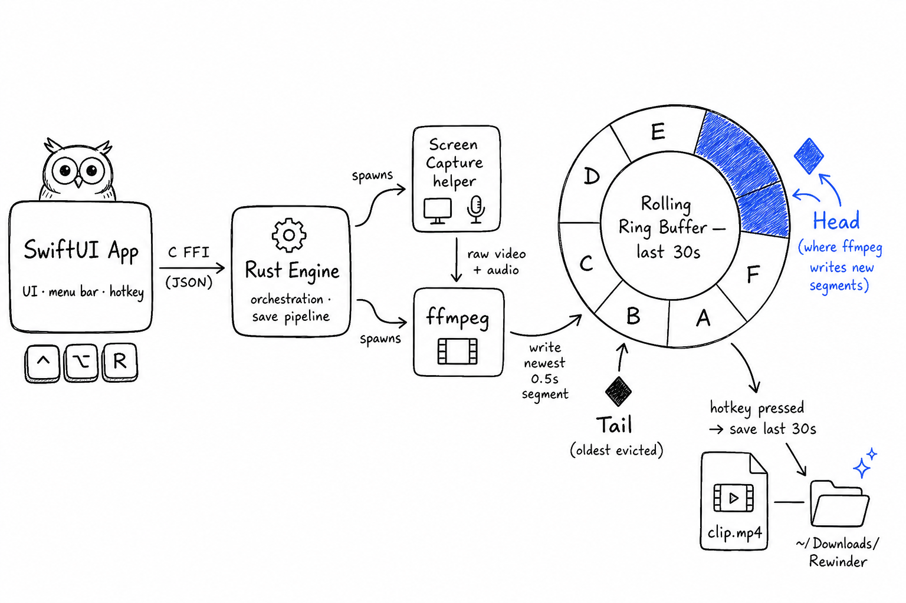

<p align="center">
  
</p>

<h1 align="center">Rewinder</h1>

<p align="center">
  Rewind your screen. Save the moment with a hotkey.<br />
  A native macOS rolling-replay recorder, like ShadowPlay for the Mac.
</p>

<p align="center">
  <a href="https://github.com/abhinavkale-dev/rewinder/releases/latest"><b>Download the latest DMG</b></a>
</p>

---

Rewinder keeps a rolling buffer of the last few seconds of your screen, system audio, and mic. Nothing is written to disk while you work. When something worth keeping happens, press the hotkey and the buffer is saved as an MP4. Miss nothing, record nothing you don't ask for.

## Features

- **Rolling replay buffer**: 15 / 30 / 60 / 90 / 120 seconds, kept in memory until you save.
- **One hotkey to save**: `Ctrl+Option+R` by default, recordable to anything you like in Settings.
- **System audio + microphone**, mixed into the clip. AI noise removal (RNNoise) cleans up fans, keyboards, and room noise from your mic.
- **Echo-safe audio routing**: on speakers, Rewinder picks an echo-cancelling mic backend so your clip never doubles the sound. On headphones it switches to a raw backend so your system audio is never ducked. It re-picks automatically when you plug or unplug.
- **Adaptive quality guard**: lowers fps under heavy system load or thermal pressure and restores it when things calm down.
- **Battery guard**: caps fps on battery (30 by default), back to full quality on AC.
- **Native and light**: SwiftUI app with the Rust engine statically linked in-process. No Electron, no WebView. See [PERFORMANCE_REPORT.md](PERFORMANCE_REPORT.md) for measurements.
- **Menu bar resident**: close the window and Rewinder stays armed in the menu bar. Quality (720p/1080p, 30/60 fps), buffer length, sounds, and window behavior are all in Settings.

Clips land in `~/Downloads/Rewinder` by default (configurable).

## Requirements

- Apple Silicon Mac
- macOS 26 (Tahoe)

The released app is Developer ID signed and notarized by Apple, so it installs with no Gatekeeper warnings: download the DMG, open it, drag Rewinder into Applications.

## How it works

<p align="center">
  
</p>

- **`RewinderApp/`**: the native SwiftUI app (UI, onboarding, settings, hotkeys, menu bar). Links the Rust engine as a C-ABI static library.
- **`src-tauri/`**: the Rust engine crate (capture orchestration, replay buffer, save pipeline, adaptive guards, settings). The folder name is a leftover from the project's Tauri origins; the Tauri shell itself is long gone.
- **`src-tauri/native/sck_capture/`**: a small Swift helper binary that talks to ScreenCaptureKit and CoreAudio (capture, mic backends, audio route watching).
- **`web/`**: the Next.js landing page.

## Build from source

Prerequisites: Xcode 26 toolchain (Swift 6.2+) and a Rust toolchain.

Run in development:

```bash
cd src-tauri && cargo build --lib && cd ..
cd RewinderApp && swift run
```

Build a packaged app:

```bash
cd RewinderApp
scripts/package_app.sh            # release build -> RewinderApp/build/Rewinder.app
scripts/package_app.sh --debug    # faster debug build
```

This builds the Rust static lib and the Swift binary, bundles the capture helper plus a static `ffmpeg`/`ffprobe`, and signs the app. See [RewinderApp/README.md](RewinderApp/README.md) for architecture details.

To produce a signed, notarized, distributable DMG (requires an Apple Developer Program membership):

```bash
cd RewinderApp
scripts/release_dmg.sh            # -> dist/Rewinder-<version>.dmg (signed + notarized + stapled)
```

## Troubleshooting

**macOS still shows the capture indicator after quitting.** Kill any stray capture workers and reset the menu bar UI:

```bash
pkill -f "rewinder-sck-capture|ffmpeg.*\.rewinder-live"
killall ControlCenter
```

If the indicator persists with no Rewinder processes running, it is stale macOS UI state; it clears on sign out/in.
